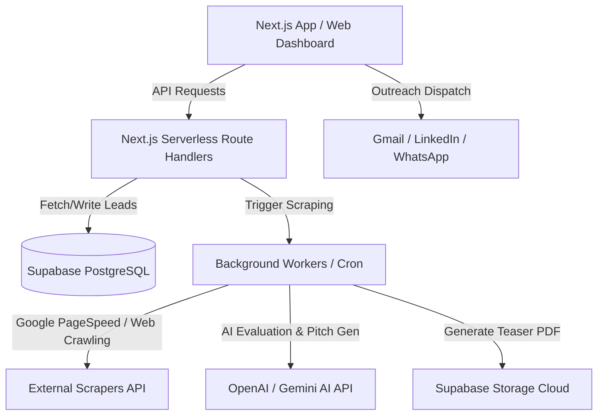

# GRIE: Architecture & Implementation Roadmap

This document provides a deep-dive gap analysis of the current Global Revenue Intelligence Engine (GRIE) codebase against your 10-module vision, proposes a professional SaaS-ready architecture, and outlines the step-by-step roadmap to scale it.

---

## 1. Gap Analysis: Where We Stand

| Module | Vision / Specification | Current Implementation Status | Gaps to Address |
| :--- | :--- | :--- | :--- |
| **M1: Lead Discovery** | Global scraper/crawler, startup database indexer, intent scorer. | 🟢 **Partial (Simulated)**: A candidate pool in `/api/generate-leads` randomly adds pre-audited leads to avoid duplicates. | 🔴 Missing real scraping (Google Maps, directories, SEO/GEO signals) and automated scoring. |
| **M2: Web Intelligence** | Core Web Vitals, SEO structure, GEO, accessibility, security, tech stack detection. | 🟢 **Partial**: Cron worker queries live Google PageSpeed API; Python CLI script does basic scrape and returns mock scores. | 🔴 Missing real-time SEO parser, GEO (AI search readiness) checker, accessibility auditing, and Wappalyzer-like tech stack detection. |
| **M3: Social Media** | Profile crawls (LinkedIn, Instagram, CTAs, frequency, and branding consistency). | 🟢 **Partial (Mocked)**: Static statuses shown in UI and used for scoring. | 🔴 Missing scrapers/APIs for social profile validation and real brand asset analysis. |
| **M4: Business Growth** | Reputation, reviews, case studies, conversion systems, lead capture checking. | 🟢 **Partial (Mocked)**: Manual audit summary includes signal-based write-ups (e.g. click-to-call bugs). | 🔴 Missing automatic review count/rating scrapers (Yelp, Google Reviews) and check for CRM/form presence. |
| **M5: AI & Automation** | Automations (Chatbots, qualifications), recommended solutions, complexity & valuation. | ⚪ **Not Implemented**: Generic opportunities are returned. | 🔴 Missing AI evaluation engine to determine exactly which chatbot/automation fits. |
| **M6: Revenue Engine** | Priority ranking, country-aware project size, confidence scores. | 🟢 **Completed**: `calculateCountryProjectValue` dynamically calculates pricing bracket based on target country. | ⚪ Fully functional, but can be enhanced with scoring weights. |
| **M7: Proposal Gen** | PDF summary generator, scope of work, recommended steps. | 🟢 **Completed**: ReportLab engine (`scripts/pdf_generator.py`) builds a premium 2-page Teaser Audit PDF. | 🔴 PDF generation is running locally (offline file writing); Vercel cannot save files locally. |
| **M8: Outreach** | Personalized, helpful drafts (Email, LinkedIn, WhatsApp). | 🟢 **Completed**: UI generates multi-channel drafts; offers action buttons to trigger Gmail, copy LinkedIn, or load WhatsApp. | ⚪ Fully functional template system. Can be enhanced with AI-powered draft personalization. |
| **M9: Client Pipeline** | Kanban tracking (New, Qualified, Contacted, Replied, Converted). | ⚪ **Not Implemented**: UI has placeholder tabs and simple approval statuses. | 🔴 Missing database-backed pipeline updating (leads reset on server restart). |
| **M10: Dashboard** | Aggregate charts (Leads by country, industry, total revenue potential). | ⚪ **Not Implemented**: UI only has a split-screen lead detail view. | 🔴 Missing metrics cards, chart visualizer, and filters. |

---

## 2. SaaS-Ready Architecture (Pro Level)

To transition GRIE from an internal script tool to a scalable enterprise platform:

### Key Architectural Enhancements:
1. **Supabase Database Persistence**: Replace in-memory arrays with PostgreSQL tables so that data is persistent, searchable, and secure.
2. **Cloud PDF Storage**: Move generated PDF reports from the local `/public` folder to a **Supabase Storage Bucket** so Vercel can serve them dynamically.
3. **AI-Driven Auditing (Gemini/OpenAI)**: Pass the crawled HTML metadata and PageSpeed results to Gemini/OpenAI to generate custom, context-aware opportunities (Module 5) and pitches (Module 8) rather than hardcoded mock templates.
4. **Enterprise Design System**: Implement a cohesive, fully responsive UI utilizing Tailwind CSS, premium typography (Inter/Outfit), clean card layouts, interactive charts, and animations.

---

## 3. Proposed Next Steps (Phase 1.5 - Production Persistence & UI Refactor)

We propose focusing the next sprint on making the core platform **fully functional, persistent, and visually stunning** on Vercel:

### Step 1: Connect Supabase PostgreSQL Database
- Install `@supabase/supabase-js`.
- Define a secure Database Client and Schema.
- Migrate `src/app/api/leads/store.ts` to read and write directly to Supabase PostgreSQL.
- Add support for changing lead verification stages in the database.

### Step 2: Implement Reporting Dashboard (Module 10) & Pipeline UI (Module 9)
- Refactor `src/app/page.tsx` to include:
  - **KPI Scorecards**: Total Leads, Total Estimated Revenue, Average Lead Score, Conversion Rate.
  - **Pipeline Progress Bar/Tabs**: Group leads by status (New, Contacted, Converted, etc.) with a drag-and-drop or one-click status updates.
  - **Premium Theme**: Indigo/Slate dark-accented modern UI with responsive grids, hover feedback, and smooth micro-animations.

### Step 3: AI-Enriched Scraper Integration
- Add an API endpoint `/api/leads/analyze` that hooks into a web parser and runs Gemini AI to output real, target-specific vulnerabilities and pitch suggestions.

---

## 4. User Feedback Required

> [!IMPORTANT]
> To proceed, please confirm the following:
> 1. Do you have a **Supabase URL & Anon Key** ready? (If yes, please add them to your `[.env.local](file:///d:/Arulkumaran/samples/rw-os-app-v2/roamwork-os-app/.env.local)` file so we can begin coding the database integration).
> 2. Should we prioritize the **Supabase Database Persistence** first, followed by the **Premium Dashboard & Pipeline UI Refactor**?

## 5. Verification Plan

- **Database Connectivity**: Verify API routes retrieve and save records correctly from the Supabase tables.
- **Next.js Compilation**: Ensure `npm run build` continues to succeed.
- **UI Responsiveness**: Manually test the refactored Dashboard UI across mobile, tablet, and desktop breakpoints.
